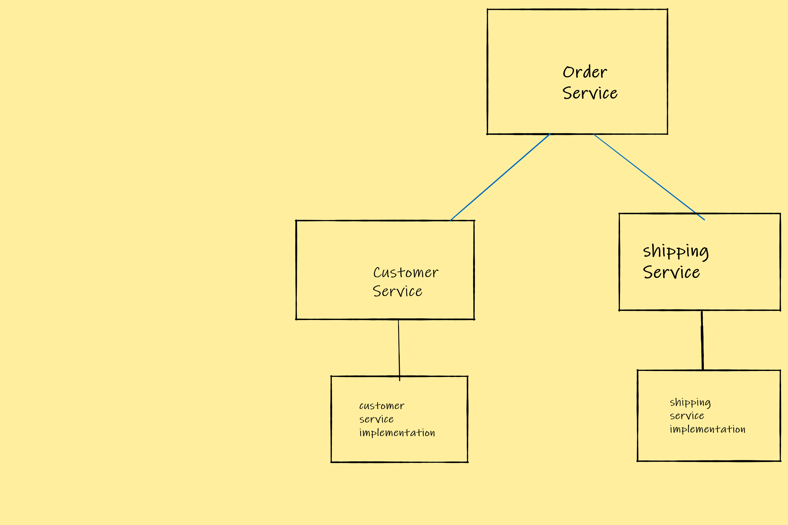

### Dependency Injection
* _DI_ Pattern 
  


#### DI
* DI is build upon the concept of polymorphism and interface composition.
* The dependent service or a component depends on abstractions but not concrete implementations. This is interface composition pattern.

* When we expand on the interface composition pattern and does not use 'New' to instantiate the interface with the Subsitution of concrete implementation directly in the dependent service then we can say that we are using DI pattern.

* Though this not strictly required for the code to be functional but is a convenient way to design the code because the dependent Service is  unaware of concrete implementation directly in the code.
* This brings the loose coupling on steriods because the concrete implementation can be switched behind the scenes even with out touching the dependent service (i.e the 'New' parts)




* In the above diagram we have the Order Service which depends on Customer Service and Shipping Service.

* Customer Service and Shipping Service are Interfaces which serves Order Service which means we are using interface composition pattern
* Now the Order Service does not have direct relation ship with the concrete implementations of Customer Service and Shipping Service.
#### _Pseudo code (NO-DI)_
```

OrderService (CustomerService, ShippingService);
# instantiate Order Service
oservice= New OrderService(new CustomerServiceImplementation(), new ShippingServiceImplementation())

```
* Now lets use DI pattern and see if we can improve on the above pattern

#### _Pseudo code (DI)_
```

OrderService (CustomerService, ShippingService);
# instantiate Order Service
oservice= New OrderService(DI.get("CustomerServiceImplementation"),  DI.get("ShippingServiceImplementation"))

```
* Now note that the we never had to directly use Concrete Implementation. Instead we used a pointer to Concrete Implementation which is stored elsewhere in the code base.

* Note that the "DI" here is some form of state machine( a class or a file etc) which holds the pointer data.
* In this case the pointer "CustomerServiceImplementation" is mapping to the actual class of Concrete implementation in the state machine.
* Now instead of calling this DI as a state machine the standard name the industry follows is Dependency Injection Container. 

#### _Example naive implementation of the above concept_

[**example code**](code/index.ts)


#### FrameWorks

* Instead of coding our own DI container there are several DI containers which are built and battle tested.
* The most widely used in Java frameworks is Spring Boot and Spring Framework.
* In the Javascript/Typescript world we have NestJs, NextJs which are widely used.
* Most notably on the Frontend world Angular is built on top of DI.

 


